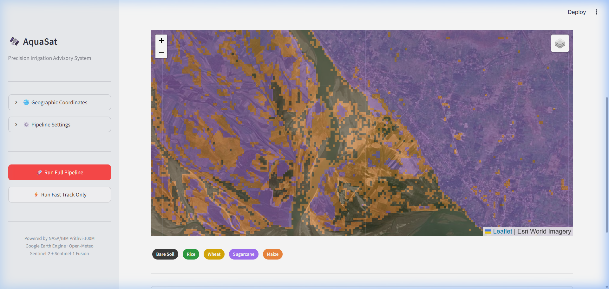
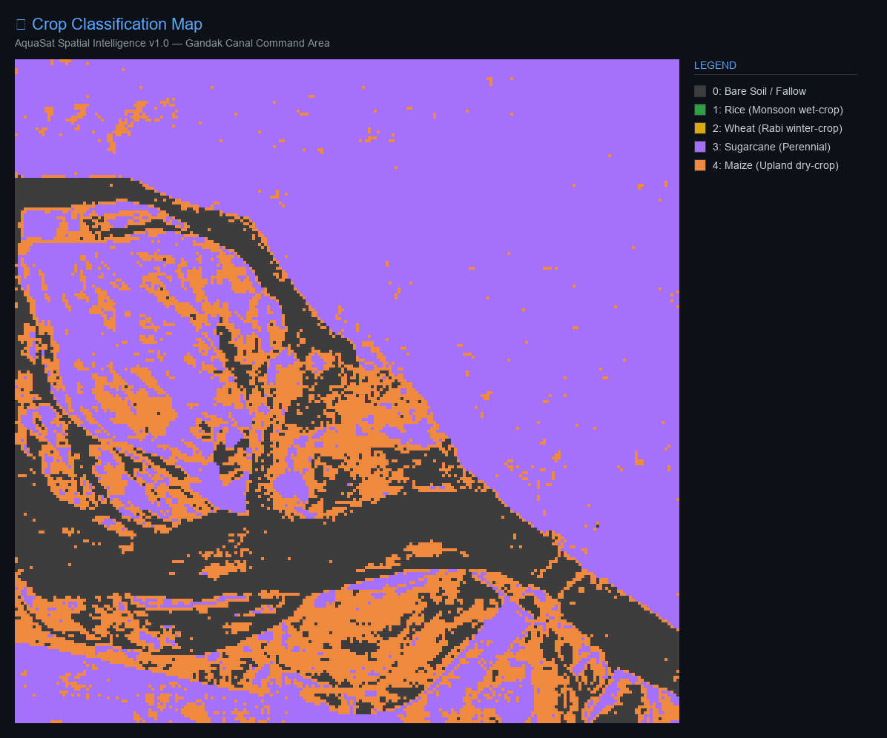
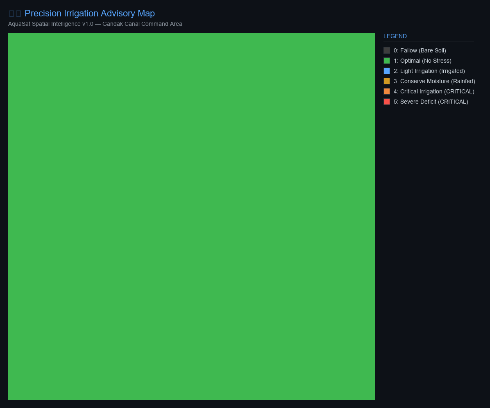

<p align="center">
  
</p>

<h1 align="center">🛰️ AquaSat v1.0</h1>

<p align="center">
  <strong>Precision Irrigation Advisory System for India's Canal Command Areas</strong>
</p>
<p align="center">
  <em>Two-Speed Geospatial Intelligence · NASA/IBM Prithvi-100M Foundation Model</em><br>
  <em>Sentinel-2 + Sentinel-1 Fusion · FAO-56 Penman-Monteith Hydrology · Real-Time Weather</em>
</p>

<p align="center">
  
  
  
  
  
</p>

---

## Overview

**AquaSat** is an end-to-end geospatial AI pipeline that delivers pixel-level irrigation advisories for India's canal command areas. It fuses multi-sensor satellite imagery from Google Earth Engine with real-time weather data and physics-based hydrology to classify crops, track growth stages, and forecast daily soil moisture stress — all without requiring ground-truth labels or field sensors.

The system is built around a **Two-Speed Architecture** that separates computationally expensive crop mapping (Slow Track) from lightweight daily moisture forecasting (Fast Track), enabling both strategic planning and real-time operational decisions.

### Key Innovation

Traditional crop advisory systems rely on sparse ground stations and weekly satellite revisits. AquaSat solves two critical problems:

1. **Monsoon cloud obstruction** — India's Kharif cropping season (June–October) coincides with heavy monsoon cloud cover that blocks optical satellites. AquaSat fuses cloud-free SAR radar with optical imagery using Radar Vegetation Index (RVI) anchoring and Savitzky-Golay temporal smoothing to reconstruct gap-free time series.

2. **Latency gap** — Foundation model inference is expensive and runs every 10–15 days. AquaSat bridges this gap with a lightweight Fast Track that uses cached neural embeddings + FAO-56 physics to produce daily moisture stress forecasts at zero additional satellite cost.

---

## Architecture

```
┌─────────────────────────────────────────────────────────────────────┐
│                     GOOGLE EARTH ENGINE                             │
│  Sentinel-2 SR (Optical)  +  Sentinel-1 GRD (SAR Radar)            │
│  15-day median temporal binning  ·  QA60 + SCL cloud masking        │
└──────────────────────┬──────────────────────────────────────────────┘
                       │
                       ▼
┌─────────────────────────────────────────────────────────────────────┐
│                  CLOUD GAP FILLING MODULE                           │
│  Radar Vegetation Index (RVI) Anchoring                             │
│  Savitzky-Golay Temporal Smoothing                                  │
│  Output: Cloud-free 6-band optical time series                      │
└──────────────────────┬──────────────────────────────────────────────┘
                       │
          ┌────────────┴────────────┐
          ▼                         ▼
┌──────────────────┐     ┌──────────────────────────────┐
│   SLOW TRACK     │     │        FAST TRACK             │
│   (Every 15d)    │     │        (Daily)                │
│                  │     │                               │
│ NASA Prithvi-100M│────▶│ Cached 768-dim Embeddings    │
│ Foundation Model │     │ + FAO-56 Penman-Monteith ET  │
│                  │     │ + Open-Meteo Weather API      │
│ ┌──────────────┐ │     │ + 350km Wind Vector Analysis  │
│ │Crop Classif. │ │     │                               │
│ │Rice/Wheat/   │ │     │ Output:                       │
│ │Sugarcane/    │ │     │ • Daily moisture stress prob. │
│ │Maize         │ │     │ • Soil water depletion (mm)   │
│ └──────────────┘ │     │ • Predicted NDWI maps         │
│ ┌──────────────┐ │     └───────────────┬───────────────┘
│ │Growth Stage  │ │                     │
│ │Tracking      │ │                     │
│ └──────────────┘ │                     │
└──────────────────┘                     │
          │                              │
          └──────────────┬───────────────┘
                         ▼
┌─────────────────────────────────────────────────────────────────────┐
│                  IRRIGATION ADVISORY ENGINE                         │
│  Canal Distance Mapping  ·  Command Zone Classification             │
│  Pixel-level advisory codes (6 levels)                              │
│  GeoTIFF Export  ·  Streamlit Dashboard with Folium Overlays        │
└─────────────────────────────────────────────────────────────────────┘
```

---

## Two-Speed Architecture

### 🐌 Slow Track — Every 10–15 Days

Runs the NASA/IBM **Prithvi-100M** geospatial foundation model (or a local Conv3D fallback encoder) on cloud-reconstructed, multi-temporal Sentinel-2 imagery to produce:

| Output | Shape | Description |
|--------|-------|-------------|
| Crop Map | `(224, 224)` | Pixel-level crop type: Rice, Wheat, Sugarcane, Maize, Bare Soil |
| Stage Map | `(224, 224)` | Phenology growth stage: Initial, Development, Mid, Late |
| Baseline Embeddings | `(768, 224, 224)` | Dense feature vectors that anchor the Fast Track |

### ⚡ Fast Track — Daily

Lightweight daily loop that combines cached neural embeddings with physics-based hydrology:

1. **FAO-56 Penman-Monteith** reference evapotranspiration (ET₀) from Open-Meteo weather
2. **Crop-specific ET_c** adjusted by growth stage and crop coefficient (Kc)
3. **Root-zone soil water balance** tracking depletion and effective rainfall
4. **Neural NDWI prediction** from cached Prithvi embeddings via CNN regressor
5. **Hybrid fusion**: 70% physical stress + 30% neural moisture proxy

---

## Foundation Model: NASA/IBM Prithvi-100M

[Prithvi-100M](https://huggingface.co/ibm-nasa-geospatial/Prithvi-100M) is a 100-million parameter geospatial foundation model pre-trained on NASA's Harmonized Landsat-Sentinel (HLS) dataset. It processes multi-spectral, multi-temporal satellite imagery through a Vision Transformer (ViT) encoder.

**AquaSat integrates Prithvi via:**
- Custom **LoRA** (Low-Rank Adaptation) layers for parameter-efficient fine-tuning
- FP16 mixed-precision inference
- A downstream adapter head for joint crop classification + stage regression
- A **Conv3D fallback encoder** for offline / GPU-free environments

> [!NOTE]
> **Model Weight Execution & Fallback Mechanism:**
> By default, the system operates in **Conv3D Fallback Mode** (`use_fallback=True` in `slow_track.py` and the dashboard) to bypass heavy downloads of foundation weights and function in CPU-only/offline developer environments out-of-the-box.
>
> To activate the live `Prithvi-100M` model:
> 1. Download the pre-trained weights file `Prithvi_100M.pt` from the official [Hugging Face repository](https://huggingface.co/ibm-nasa-geospatial/Prithvi-100M/tree/main).
> 2. Create the `models/` directory in the root and place the weights file inside: `models/Prithvi_100M.pt`.
> 3. Disable the fallback flag inside `src/slow_track.py` or the dashboard sidebar settings (`use_fallback=False`).

---


## Dashboard

<p align="center">
  
</p>

The Streamlit web dashboard provides:
- **Sidebar** — ROI configuration, pipeline triggers (Full Pipeline / Fast Track Only), date picker
- **Live Weather Metrics** — Temperature, rainfall, wind speed/direction, evaporation factor
- **Interactive Map Tabs** (Folium over Esri World Imagery):
  - 🗺️ Irrigation Advisory — 6-level pixel overlay with GeoTIFF download
  - 🌾 Crop Classification — Rice / Wheat / Sugarcane / Maize
  - 💧 Moisture Stress — 5-bin probability heatmap
- **Advisory Distribution Table** — Pixel counts and coverage percentages

---

## 🎨 Showcase Outputs

Static visual representations of pixel-level pipeline outputs generated from live Sentinel-2 and Sentinel-1 data are stored in the [sample_outputs/](file:///d:/MY%20Projects/antigravity/Kaggle%20Project/sample_outputs) directory:

### 🌾 Crop Classification Map
Pixel-level classification boundaries matching the satellite basemap terrain (rivers, roads, and fields):


### 🗺️ Precision Irrigation Advisory Map
Pixel-level advisories calculated by combining moisture stress and irrigation masks:


- **Sample GeoTIFF File**: [sample_advisory_map.tif](file:///d:/MY%20Projects/antigravity/Kaggle%20Project/sample_outputs/sample_advisory_map.tif) — Georeferenced (EPSG:4326) advisory map ready for GIS ingestion (QGIS/ArcGIS).

---


## Irrigation Advisory Codes

| Code | Level | Zone | Action |
|------|-------|------|--------|
| 0 | Fallow | — | No action (bare soil) |
| 1 | Optimal | All | Crop moisture within safe thresholds |
| 2 | Light Irrigation | Irrigated | Schedule supplementary canal release |
| 3 | Conserve Moisture | Rainfed | Apply mulching, reduce tillage |
| 4 | **Critical** | Irrigated | **Immediate canal release required** |
| 5 | **Severe Deficit** | Rainfed | **Emergency advisory: crop at risk** |

---

## Modules

| Module | File | Purpose |
|--------|------|---------|
| Configuration | `src/config.py` | ROI coordinates, band mappings, GEE collections, LoRA hyperparameters |
| GEE Pipeline | `src/gee_pipeline.py` | Sentinel-2/1 ingestion, temporal binning, sequential per-interval download |
| Gap Filling | `src/gap_filling.py` | RVI anchoring, Savitzky-Golay smoothing, cloud reconstruction |
| Foundation Model | `src/foundation_model.py` | Prithvi-100M ViT adapter, LoRA layers, Conv3D fallback encoder |
| Slow Track | `src/slow_track.py` | Crop classification, phenology staging, embedding extraction |
| Fast Track | `src/fast_track.py` | Daily CNN regressor, NDWI prediction, moisture stress fusion |
| Weather Analytics | `src/weather_analytics.py` | Open-Meteo API, 350km wind vector analysis |
| Water Deficit | `src/water_deficit.py` | FAO-56 ET₀ calculation, crop ET_c, root-zone water balance |
| Advisory | `src/advisory.py` | Canal command zones, advisory generation, GeoTIFF export |
| Dashboard | `src/app.py` | Streamlit web UI with Folium satellite map overlays |
| Integration Test | `tests/test_pipeline.py` | Full E2E pipeline test with ASCII diagnostic maps |

---

## Quick Start

### Prerequisites

- Python 3.10+
- Google Earth Engine account ([sign up](https://earthengine.google.com/))
- GCP project with Earth Engine API enabled

### Installation

1. **Clone and install runtime dependencies:**
```bash
git clone https://github.com/QuorLum/aquasat.git
cd aquasat
pip install -r requirements.txt
```

2. **Install developer/testing dependencies (optional):**
```bash
pip install -r requirements-dev.txt
```

> [!NOTE]
> **Environment Pinning & Tested Versions:**
> This repository is fully tested and pinned against:
> - `torch==2.12.1+cpu`
> - `transformers==5.12.1`

### Earth Engine Authentication

```bash
earthengine authenticate
```

Update the GCP project ID in `src/config.py`:
```python
ee.Initialize(project="your-gcp-project-id")
```

### Run the Pipeline Test

```bash
python tests/test_pipeline.py
```

#### Expected Test Console Output:
```text
[Config] Initializing Earth Engine project: kaggle-project-499515
[Config] Earth Engine successfully initialized.
[GEE API] Earth Engine initialized successfully.
[E2E Test] Starting Geospatial Architecture End-to-End Test...
[E2E Test] Sampling ROI Chunk coordinates: [84.5, 25.8, 84.6, 25.9]
[GEE API] Timestep 0 (2025-06-01 to 2025-06-16) downloaded successfully.
[GEE API] Timestep 1 (2025-06-16 to 2025-07-01) downloaded successfully.
...
[E2E Test] Running cloud gap filling and radar-anchored interpolation...
[E2E Test] Gap filling completed. Shape verified.
[E2E Test] Running Slow Track crop classification and stage tracking...
[Slow Track] Completed. Classification maps generated using Conv3D Fallback.
[E2E Test] Slow Track inference validated.
[E2E Test] Weather Fetched (Status: success). Temp Max: 33.7C, Rain: 0.3mm.
[E2E Test] Fast Track execution validated.
[E2E Test] Generating pixel-level irrigation advisories...
[Advisory Exporter] Successfully exported GeoTIFF map to output/test_advisory_map.tif
[E2E Test] ALL INTEGRATION TESTS PASSED SUCCESSFULLY.
```

### Launch the Dashboard

```bash
streamlit run src/app.py
```

---


## Study Area

**Gandak Canal Command Area, Bihar, India**

| Parameter | Value |
|-----------|-------|
| Coordinates | 84.5°E – 85.0°E, 25.8°N – 26.3°N |
| Season | Kharif (June – October) |
| Primary Crops | Rice, Sugarcane, Maize |
| Optical Sensor | Sentinel-2 SR Harmonized |
| Radar Sensor | Sentinel-1 GRD |
| Weather Source | Open-Meteo Archive + Forecast APIs |

---

## Tech Stack

| Layer | Technology |
|-------|-----------|
| Satellite Data | Google Earth Engine (Sentinel-2 SR, Sentinel-1 GRD) |
| Foundation Model | NASA/IBM Prithvi-100M (ViT, LoRA fine-tuning) |
| Deep Learning | PyTorch, Hugging Face Transformers |
| Hydrology | FAO-56 Penman-Monteith, Root-Zone Water Balance |
| Weather | Open-Meteo Archive + Forecast APIs |
| Geospatial I/O | Rasterio (GeoTIFF), EPSG:4326 |
| Dashboard | Streamlit, Folium, Pillow |
| Cloud Reconstruction | Savitzky-Golay Filter, Radar Vegetation Index (RVI) |

---

## Project Structure

```
aquasat/
├── src/
│   ├── config.py              # Geospatial & model configuration
│   ├── gee_pipeline.py        # GEE ingestion & temporal binning
│   ├── gap_filling.py         # Cloud gap filling & radar anchoring
│   ├── foundation_model.py    # Prithvi-100M + LoRA + Conv3D fallback
│   ├── slow_track.py          # Crop classification & staging
│   ├── fast_track.py          # Daily moisture stress forecasting
│   ├── weather_analytics.py   # Open-Meteo weather & wind analysis
│   ├── water_deficit.py       # FAO-56 ET & soil water balance
│   ├── advisory.py            # Advisory generation & GeoTIFF export
│   └── app.py                 # Streamlit web dashboard
├── tests/
│   └── test_pipeline.py       # End-to-end integration test
├── screenshots/
│   ├── ui_dashboard.png       # Crop tab dashboard screenshot
│   └── ui_advisory.png        # Advisory tab dashboard screenshot
├── sample_outputs/            # Showcase outputs (TIF, PNG, NumPy)
│   ├── sample_advisory_map.tif
│   ├── sample_advisory_map_visual.png
│   ├── sample_crop_map.npy
│   └── sample_crop_map_visual.png
├── models/                    # Model weights (gitignored)
├── output/                    # Generated GeoTIFFs (gitignored)
├── requirements.txt
├── requirements-dev.txt
├── .gitignore
└── README.md
```

---

## License

This project is open-source under the [MIT License](LICENSE).

---

<p align="center">
  Built with 🛰️ by <a href="https://github.com/QuorLum">QuorLum</a>
</p>
